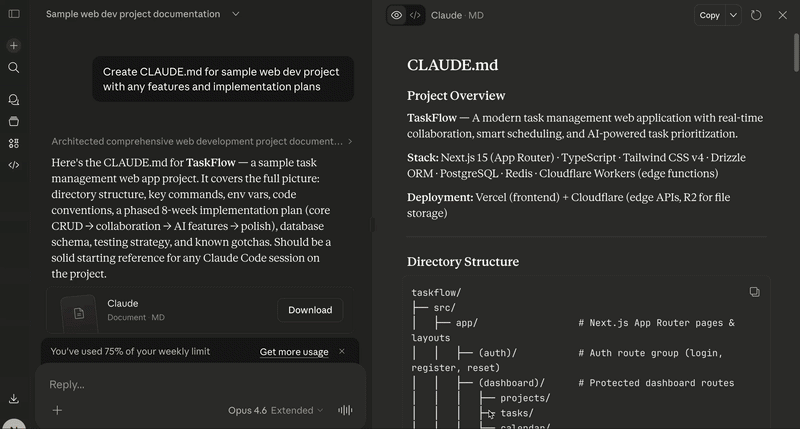

# kickstart



A bridge tool from Chat to Claude Code.
Ship your Chat strategy to a coding environment with a single command.

## What it does

Running `kickstart <project-name>` will:

1. Create a local project directory & `git init`
2. Write clipboard contents to `CLAUDE.md`
3. Generate `.vscode/tasks.json` (auto-starts Claude Code with "Start implementation" prompt on editor open)
4. Generate `.gitignore`
5. Make an initial commit
6. Open the editor in a new window

With `--remote`, it also creates a GitHub repository and pushes.

**Workflow:** Refine your project plan in Claude Chat → Copy instructions → `kickstart` → Claude Code starts with your instructions loaded

## Requirements

- macOS or Linux
- Clipboard tool:
  - macOS: `pbpaste` (built-in)
  - Linux X11: `xclip` or `xsel`
  - Linux Wayland: `wl-paste` (`wl-clipboard`)
- [gh CLI](https://cli.github.com/) (only required when using `--remote`)

## Setup

```bash
curl -fsSL https://raw.githubusercontent.com/m4suisui/kickstart/main/install | bash
```

## Usage

```bash
# Basic: create a local project with clipboard contents as CLAUDE.md
kickstart my-project

# Omit project name for interactive prompt
kickstart

# Also create a GitHub repository (private by default)
kickstart my-project --remote

# Create a private GitHub repository
kickstart my-project --private

# Create a public GitHub repository
kickstart my-project --public

# Skip Claude Code auto-start (no tasks.json)
kickstart my-project --no-claude

# YOLO mode: launch Claude Code with --dangerously-skip-permissions
kickstart my-project --yolo

# Temporarily change the project directory
kickstart my-project --dir=~/workspace

# Show help
kickstart --help
```

### Typical flow

1. Design your project plan in Claude Chat
2. Copy the final instructions to clipboard
3. Run `kickstart <project-name>` in the terminal
4. Editor opens, Claude Code starts working with your `CLAUDE.md` instructions
5. When ready to share, run `git remote add` + `git push`

## Configuration

Save defaults in `~/.kickstartrc`:

```bash
PROJECTS_DIR=~/code                  # Where projects are created (default: ~/code)
EDITOR_CMD=/path/to/your/editor      # Editor executable path
EDITOR_ARGS="--new-window"           # Arguments passed to the editor (default: --new-window)
CLAUDE_CMD=claude                    # Claude Code CLI command
```

See [`.kickstartrc.example`](.kickstartrc.example) for a working example.

## Options

| Option | Description |
|---|---|
| `--remote` | Create a GitHub remote repository and push (default: local only) |
| `--private` | Create as a private repo (implies `--remote`) |
| `--public` | Create as a public repo (implies `--remote`) |
| `--no-claude` | Skip Claude Code auto-start (no `tasks.json`) |
| `--yolo` | Launch Claude Code with `--dangerously-skip-permissions` |
| `--dir=PATH` | Override project directory (takes precedence over `~/.kickstartrc`) |
| `-h`, `--help` | Show help |

## Notes

- By default, only a local Git repository is created. No GitHub account or `gh` CLI needed for the default workflow.
- When `--remote` is used without `--public`, the repo defaults to **private** (safe by default).
- If the clipboard is empty, you'll be prompted to confirm (`y` to continue with an empty `CLAUDE.md`)
- Fails if a directory with the same project name already exists
- Supports macOS and Linux (X11/Wayland)
- The demo gif may not reflect the latest options
